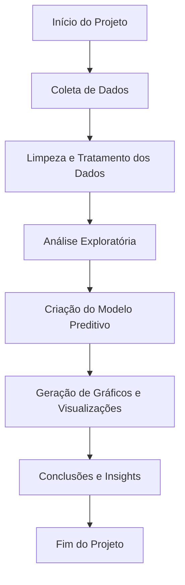

# Projeção de Dengue Brasil


Projeto acadêmico desenvolvido para a FIAP, com o objetivo de analisar dados históricos de Dengue no Brasil e projetar cenários futuros. A proposta é entender o comportamento da doença ao longo do tempo e facilitar a visualização de tendências que possam contribuir para ações preventivas.

## 📖 Descrição Geral

O projeto busca transformar dados brutos em informações acessíveis sobre os casos de Dengue no país. A partir de fontes confiáveis, realizamos a coleta, limpeza e análise dos dados, aplicando técnicas de modelagem para visualizar possíveis cenários futuros.

A ideia central é apoiar decisões de saúde pública e conscientizar a população sobre a evolução da doença.

## 🚀 Funcionalidades

- 📊 Coleta e tratamento de dados da Dengue no Brasil
- 📈 Análise de tendências históricas
- 🧩 Criação de modelo preditivo básico
- 🖼️ Visualização gráfica dos resultados
- 🧭 Fluxograma explicativo do processo

## 🧩 Fluxograma do Projeto



> 💡 **Dica:** Caso o fluxograma não carregue automaticamente no GitHub, você pode visualizar utilizando extensões como "Markdown Preview Mermaid Support".

## 🛠️ Como Executar

1. **Clone o repositório**
   ```
   git clone https://github.com/seu-usuario/projecao-dengue-brasil.git
   ```

2. **Instale as dependências**
   ```
   pip install -r requirements.txt
   ```

3. **Execute a API**
   ```
   uvicorn api:app --reload

4. **Execute o Dashboard**
   ```
   python dashboard.py
   ```

5. **Visualize os resultados**
   - Verifique as saídas na pasta `outputs/`
   - Gráficos e previsões estarão disponíveis para análise

> ⚠️ **Requisitos:** Python 3.9 ou superior.

## 🧩 Tecnologias Utilizadas

- **Python** — Linguagem principal do projeto
- **Pandas** — Manipulação e análise de dados
- **Matplotlib** — Visualização gráfica
- **Scikit-Learn** — Criação do modelo preditivo
- **Jupyter Notebook** — Desenvolvimento exploratório

## 👤 Autor

- **Adriano Ferreira de Oliveira**

## 🎯 Objetivos Futuros

- Aprimorar o modelo preditivo com mais variáveis (ex.: clima, temperatura, precipitação)
- Automatizar a atualização dos dados
- Criar dashboard interativo para visualização online

## 📝 Observações Finais

Este projeto foi desenvolvido para fins acadêmicos, como parte do curso da FIAP.  
O intuito é aplicar técnicas de ciência de dados a um problema de grande impacto social no Brasil, oferecendo uma visão clara sobre a evolução da Dengue no país.


